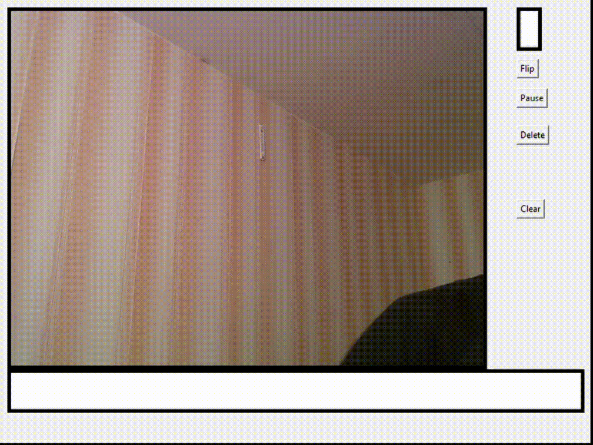
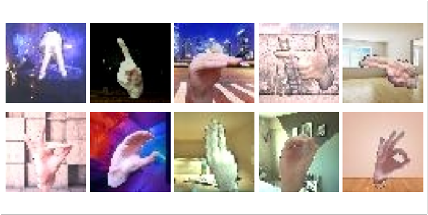
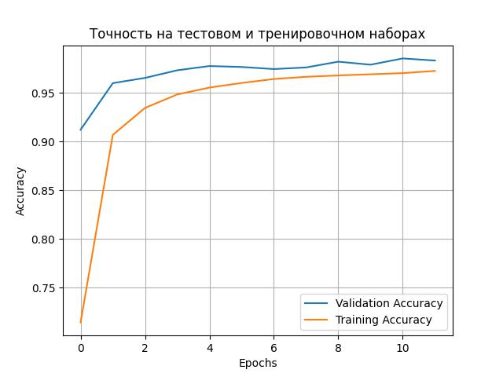
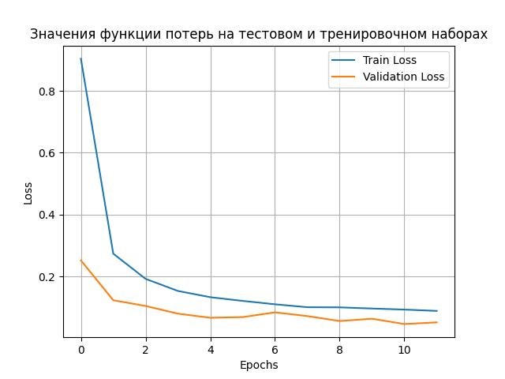

# Нейронная сеть перевода языка жестов в печатную форму

## О проекте

Система распознаёт русский дактильный алфавит (жесты пальцами) в реальном времени через веб-камеру и переводит его в печатный текст. Проект включает:

- Собственный датасет из 165 285 изображений (29 классов букв).
- Свёрточную нейронную сеть (CNN), обученную на этом датасете.
- Графический интерфейс для взаимодействия с моделью в реальном времени.
- Интеграцию с MediaPipe для детекции руки на кадре.

Проект демонстрирует полный пайплайн ML-разработки: от сбора и аугментации данных до развёртывания модели в интерактивном приложении.

---

## Демонстрация

  
*Рисунок 1 — Графический интерфейс системы*

---

## Стек технологий

| Компонент | Технологии |
| :--- | :--- |
| Язык | Python 3 |
| ML / DL | TensorFlow, Keras (Sequential API) |
| Компьютерное зрение | OpenCV, MediaPipe |
| Обработка данных | NumPy, Pandas, Scikit-learn |
| GUI | Tkinter, PIL (Pillow) |
| Аугментация данных | rembg (удаление фона), OpenCV (повороты, замена фона) |

---

## Архитектура нейронной сети

Модель построена на базе Sequential API из Keras и включает 10 слоёв:

| № | Слой | Параметры |
| :--- | :--- | :--- |
| 1 | Conv2D | 64 фильтра, 3×3, padding='same', ReLU |
| 2 | MaxPooling2D | 2×2 |
| 3 | Conv2D | 64 фильтра, 3×3, padding='same', ReLU |
| 4 | MaxPooling2D | 2×2 |
| 5 | Conv2D | 32 фильтра, 3×3, ReLU |
| 6 | MaxPooling2D | 2×2 |
| 7 | Flatten | — |
| 8 | Dense | 512 нейронов, ReLU |
| 9 | Dropout | 0.5 |
| 10 | Dense | 29 нейронов (по числу классов), Softmax |

**Компиляция:**

- Оптимизатор: adam
- Функция потерь: categorical_crossentropy
- Метрика: accuracy

**Обучение:**

- Эпох: 12
- Batch size: 32
- Входные данные: изображения 50×50×3 (RGB), нормализованные [0, 1]

---

## Датасет

Датасет собран с нуля, так как готовых наборов для русского дактильного алфавита в открытом доступе нет.

**Этапы подготовки:**

1. Съёмка видео — жесты записывались на камеру при разном освещении.
2. Разбиение на кадры — удаление смазанных и промежуточных кадров.
3. Удаление фона — библиотека rembg (нейросеть для сегментации).
4. Аугментация — повороты на ±5° и ±10°, увеличение выборки в 5 раз.
5. Замена фона — библиотека OpenCV (cv2) для подстановки случайных фонов.
6. Разметка — CSV-файл с парами filename,label.

**Итог:**

- 165 285 изображений
- 29 классов (буквы русского алфавита, кроме Ё, Й, Щ, Ъ — они вводятся через удержание)
- Размер изображений: 50×50 пикселей, RGB

  
*Рисунок 2 — Примеры изображений после обработки*

---

## Результаты обучения

| Метрика | Значение |
| :--- | :--- |
| Точность на тренировочном наборе | 0.98 |
| Точность на валидационном наборе | 0.985 |
| Функция потерь (train) | ~0.05 |
| Функция потерь (validation) | 0.048 |

**Графики обучения:**

  
*Рисунок 3 — Рост точности на тренировочном и валидационном наборах*

  
*Рисунок 4 — Снижение функции потерь*

Модель показала высокую точность и отсутствие переобучения (validation loss ниже train loss на поздних эпохах).

---

## Функциональность GUI

Интерфейс реализован на Tkinter и включает:

- Окно видеопотока — отображение кадра с камеры в реальном времени.
- Окно предсказания — текущая распознанная буква.
- Строка ввода — накопленный текст.
- Кнопки управления:
  - Flip — отражение изображения по оси Y.
  - Pause — пауза записи (жесты распознаются, но не добавляются в текст).
  - Delete — удаление последнего символа.
  - Clear — очистка строки.

**Логика ввода:**

- Удержание жеста 1 секунда → добавление буквы.
- Удержание 2 секунды → добавление букв Ё, Й, Щ, Ъ.
- Отсутствие руки 2 секунды → пробел.
- Отсутствие руки 5 секунд → точка.

---

## Как запустить

### Запускается через

    python tkinter.py

---

## Структура проекта

    gesture-recognition/
    ├── tkinter.py                  # GUI
    ├── learning.py                 # Скрипт обучения модели
    ├── 93k_colored_with_bg_v7.keras  # Обученная модель
    ├── FULL.csv                    # Разметка датасета
    ├── images/                         # Скриншоты и графики
    │   ├── interface.png
    │   ├── dataset_samples.png
    │   ├── accuracy_plot.png
    │   └── loss_plot.png
    └── README.md

---

## Ключевые особенности

- Собственный датасет из 165k изображений, собранный и обработанный с нуля.
- Аугментация данных с заменой фона для устойчивости модели к разным условиям.
- Интеграция MediaPipe для детекции руки перед классификацией.
- Real-time инференс через веб-камеру.
- Логика ввода на основе времени удержания жеста (буквы, пробел, точка).
- Высокая точность — 0.985 на валидации.

---

## Лицензия

Проект выполнен в рамках выпускной квалификационной работы. Свободен для использования в образовательных целях.
